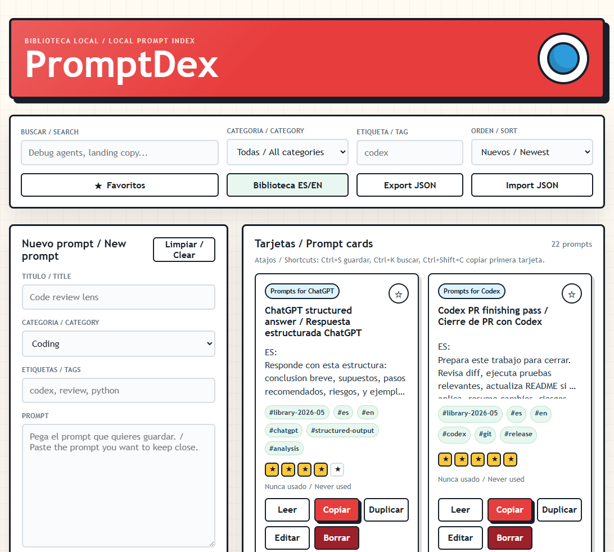

# PromptDex

> A local-first Pokedex for AI prompts: save, organize, search, rate, favorite, copy, and back up your best prompts.



PromptDex is a small local web app for people who collect useful AI prompts and want a fast, private place to keep them. It runs on your machine with FastAPI, SQLite, SQLAlchemy, and a simple HTML/CSS/JS frontend.

No accounts. No cloud sync. No external APIs. Your prompts stay local.

## Highlights

- Local SQLite persistence
- Create, edit, duplicate, and delete prompts
- Search by title, body, category, or tag
- Filter by category, tag, and favorites
- Rate prompts from 1 to 5 stars
- Copy prompt text and track `last_used_at`
- Sort by newest, rating, favorites, updated, and last used
- Export and import JSON backups
- Built-in bilingual Spanish/English starter library with 322 prompts, curated for June 2026 workflows
- Playful Pokedex-inspired responsive UI

## Quick Start

Requirements:

- Python 3.11+
- [uv](https://docs.astral.sh/uv/)

Run locally:

```powershell
uv sync
uv run uvicorn promptdex.main:app --reload --host 127.0.0.1 --port 8000
```

Open [http://127.0.0.1:8000](http://127.0.0.1:8000).

Prompt data is stored in `promptdex.db` in the project root by default. The database file is ignored by git.

## Shortcuts

- `Ctrl+S` / `Cmd+S`: save the current form
- `Ctrl+K` / `Cmd+K`: focus search
- `Ctrl+Shift+C` / `Cmd+Shift+C`: copy the first visible prompt
- `/`: focus search when you are not typing in a field

## Privacy

PromptDex is designed to be local-first:

- No authentication
- No telemetry
- No cloud sync
- No third-party API calls
- No payment or account system

Backups are plain JSON files generated locally by your browser. Review them before sharing.

## API

- `GET /api/prompts`
- `POST /api/prompts`
- `GET /api/prompts/{id}`
- `PUT /api/prompts/{id}`
- `DELETE /api/prompts/{id}`
- `POST /api/prompts/{id}/use`
- `POST /api/prompts/{id}/duplicate`
- `GET /api/categories`
- `GET /api/backup/export`
- `POST /api/backup/import`
- `POST /api/library/seed`

## Development

Run tests:

```powershell
uv run pytest
```

Run linting:

```powershell
uv run ruff check .
```

Format code:

```powershell
uv run ruff format .
```

## Project Structure

```text
promptdex/
  main.py              # FastAPI app and routes
  models.py            # SQLAlchemy model
  schemas.py           # Pydantic schemas
  seed_library.py      # Built-in bilingual starter prompts
  static/
    index.html
    styles.css
    app.js
tests/
  test_api.py
```

## Contributing

Contributions are welcome. Good first issues:

- More import/export formats
- Better prompt library packs
- UI accessibility improvements
- Optional dark mode
- Tag management and bulk edit tools

Please keep PromptDex local-first and dependency-light.

## License

MIT
